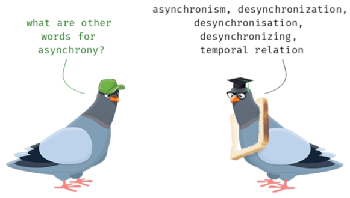
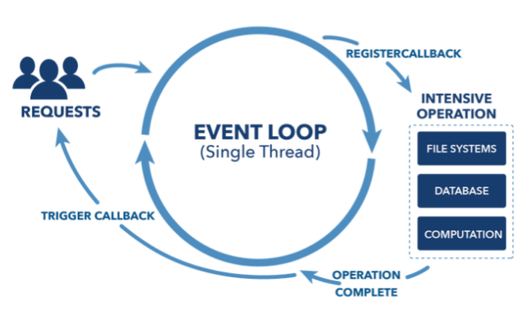
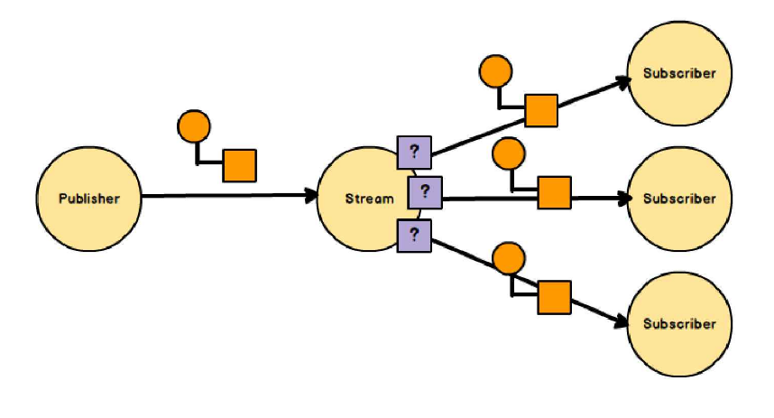

---
## Asynchronous
- the processing of an event is happening at some arbitrary time, possibly in the future

---
## Non-blocking IO

---?color=#FFFFFF
#### @color[black](Stream processing)

---
## Data Streams
- a sequence of data events over time

---
## Event-driven
- reacting to change

---
@snap[north span-100]
## ReactiveX
@snapend

@snap[midpoint span-70]
@box[bg-purple text-white demo-box-text-padding rounded](An API for *asynchronous* programming with *observable streams*.)
@snapend

